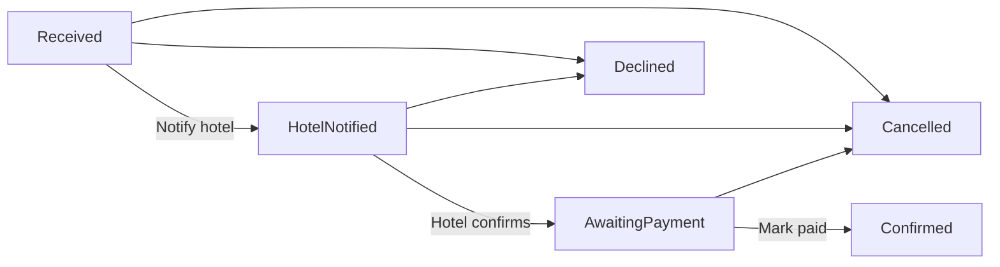
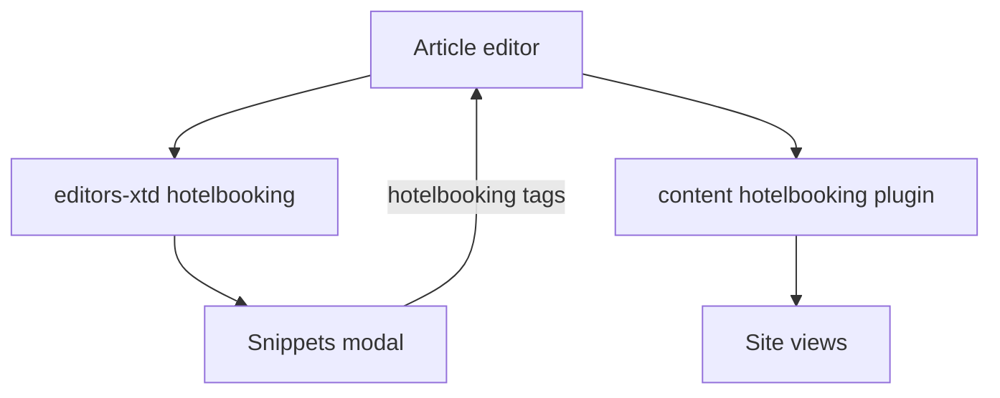

# Architecture

Custom hotel-booking code only. Joomla core lives in `administrator/`, `components/`, `libraries/`, and so on, and is not described here.

PHP namespaces use the `Learn\` prefix (see `com_hotelbooking`’s `<namespace>` in [`administrator/components/com_hotelbooking/hotelbooking.xml`](../administrator/components/com_hotelbooking/hotelbooking.xml)).

## Component

`Learn\Component\Hotelbooking` — admin CRUD plus site views.

**Administrator:** destinations, rooms, bookings, FAQs, and the snippets picker modal (`view=snippets`) used by the editor button. Site-wide FAQs are Super User only; hotel managers edit per-hotel FAQs on the destination/room form instead.

**Site** routes are registered in [`components/com_hotelbooking/src/Service/Router.php`](../components/com_hotelbooking/src/Service/Router.php):

| View | Role |
|------|------|
| `home` | Hotel search / landing home |
| `destinations` → `destination` → `room` | Catalogue |
| `hotel` | Hotel landing page (destination id in the URL) |
| `cityguide` | City Guide page |
| `bookings` | Guest booking form / list |
| `faqs` | Published FAQs |

HTMX fragment tasks (`destinations.items`, `booking.submit` when `HX-Request: true`) return layouts from [`components/com_hotelbooking/layouts`](../components/com_hotelbooking/layouts) and close the app. Do not use `tmpl=component` for these swaps: that still wraps [`templates/tpl_hotelbooking/component.php`](../templates/tpl_hotelbooking/component.php). CSRF tokens are attached in [`media/com_hotelbooking/js/htmx-joomla.js`](../media/com_hotelbooking/js/htmx-joomla.js); flash messages use an `HX-Trigger` `hbMessage` event.

## Booking workflow

Joomla `com_workflow` stores the current **stage** of each booking in `#__workflow_associations`. That row is the durable pointer: if the site goes down, the booking is still in the last saved stage. Allowed moves are **transitions**. `plg_workflow_hotelbooking` sends the hotel email in `onWorkflowBeforeTransition`; a failed notify calls `setStopTransition()` so the stage does not advance and the same transition can be retried. Status columns on `#__hotelbooking_bookings` are updated only after a successful transition.



The workflow is seeded for `com_hotelbooking.booking` and can be inspected under Components → Workflows (including the graph view). The booking edit **Notify Hotel** toolbar button stays available: when the booking is in **Received**, it runs the same notify transition (email first; failure does not advance the stage). On later stages it only resends the email. Turn workflow off with `workflow_enabled` to restore free-form status fields.

## Snippet tags

Articles can embed promo cards. The editors-xtd plugin opens the snippets modal; Insert writes a tag; the content plugin renders it on the site.



Tag shapes:

```
{hotelbooking type="destination" id="N"}
{hotelbooking type="room" id="N"}
{hotelbooking type="offer" entity="destination|room" id="N" index="I"}
```

## Hotel landing modules

These modules read the **destination id from the Hotel Landing URL** (not a hardcoded module parameter):

| Module | Output |
|--------|--------|
| `mod_hotelhero` | Full-width hero |
| `mod_hoteldetails` | Intro, offers sidebar, CTA |
| `mod_hotelrooms` | Published rooms for that destination |

## Templates

Both are Cassiopeia children.

| Template | Use |
|----------|-----|
| `tpl_hotelbooking` | Main site: CSS/JS and layout overrides (article, contact, user profile) |
| `tpl_cityguide` | Menu-item template style with positions `city-hero`, `city-intro`, `city-highlights`, `city-sidebar`, `city-bottom` |

## Consents

[`plugins/system/hbconsent`](../plugins/system/hbconsent) records **guest** Privacy Consents with `user_id` 0:

- Contact form ticks
- Cookie-banner Accept

Logged-in users still go through Joomla’s core Privacy Consent plugin.
